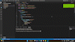

# Spring to Flask Web App Converter

Spring to Flask Web App Converter is a simple web application that allows you to convert a Spring web application to a Flask application. The application provides a user-friendly interface for uploading your Spring web application and downloading the corresponding Flask application.

## Features

- Upload your Spring web application as a ZIP file.
- Convert the Spring web application to a Flask application.
- Download the Flask application as a ZIP file.

## Technologies

The Spring to Flask Web App Converter uses the following technologies:

- Spring Boot
- Flask
- Python Flask
- Python ZipFile library
- HTML/CSS
- Python javaLang Library
- React.Js

## Getting Started

Before you can run this project, you must have the following software installed on your computer:

- Node.js (version 10 or higher)
- npm (version 6 or higher)
- Python 3.7
- pip

To run the Spring to Flask Web App Converter, follow these steps:

1. Clone the repository to your local machine.
2. Open the `Backend Flask` directory in your terminal.
3. Start the Flask application:

    ```
    $ virtualenv venv
    $ source venv/bin/activate
    $ pip install -r requirements.txt
    $ python app.py
    ```
4. Open a separate terminal
5. Open the `Frontend React` directory in your terminal.
6. Start the React application:

    ```
    $ npm install
    $ npm start
    ```
## Usage

1. Click on the "Choose File" button to select your Spring web application ZIP file.
2. Click on the "upload" button to start the conversion process.
3. Once the conversion is complete, Flask application will be automaticaly downloaded as a ZIP file once the timer ends.

## Working


## Screenshots


## License

The Spring to Flask Web App Converter is open source software released under the MIT license.
